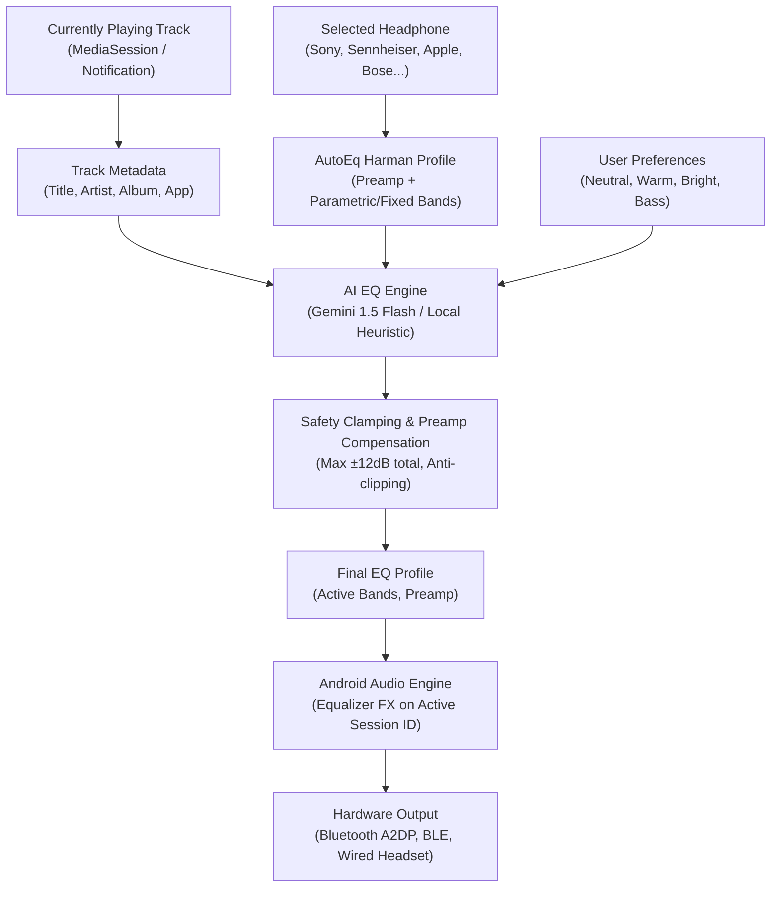

# SPECIFICATION: AI EQ ANDROID APPLICATION

## 1. Executive Summary & Purpose

The **AI EQ** application is an intelligent, context-aware acoustic optimization system for Android. It continuously tracks currently playing media (via MediaSession / NotificationListener), matches the connected or user-selected headphone against an embedded, verified **AutoEq** acoustic measurement database, and computes safety-clamped, harmonic AI equalization adjustments on top of the AutoEq target curve.

---

## 2. End-to-End Pipeline

---

## 3. Core Architectural Modules

1. **`domain/model`:** Immutable data models (`TrackMetadata`, `HeadphoneProfile`, `AutoEqProfile`, `EqBand`, `AiEqAdjustment`, `FinalEqProfile`, `AudioOutputInfo`).
2. **`domain/pipeline`:** 
   - `EqSafetyClamper`: Enforces hardware limits, prevents digital clipping via automatic negative preamp offset.
   - `AiEqPipeline`: Coordinates inputs, calls AI provider with structured JSON contract, applies safety clamping.
   - `EqCacheManager`: In-memory and persistent hash-keyed cache preventing redundant AI network requests.
3. **`data/autoeq`:** Curated, MIT-licensed database of popular headphone measurements and frequency response profiles.
4. **`data/ai`:** 
   - `AiEqProvider`: Common interface.
   - `GeminiApiProvider`: Google Gemini REST API with JSON schema enforcement.
   - `LocalHeuristicAiProvider`: High-speed offline fallback engine using psychoacoustic models.
5. **`data/security`:** 
   - `ApiKeyStore`: Secure Keystore-backed storage for Gemini API keys.
6. **`media`:**
   - `MediaDetectionManager`: MediaSession monitoring and track change detection.
   - `AiEqNotificationListener`: NotificationListenerService required for `MediaSessionManager.getActiveSessions()`.
   - `MockMediaTrackProvider`: Test track generator for development and validation.
7. **`audio`:**
   - `AudioEngineManager`: Safe wrapper around `android.media.audiofx.Equalizer`, session ID management, capability detection.
   - `AudioEffectBroadcastReceiver`: Catches player session broadcast events (`ACTION_OPEN_AUDIO_EFFECT_CONTROL_SESSION`).
8. **`ui`:**
   - Material 3 Expressive Jetpack Compose interface with real-time dynamic curve visualizer, band sliders, headphone selector modal sheet, and capability badges.
